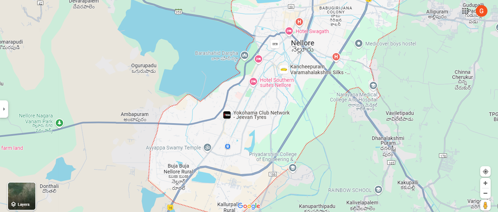

# Ex04 Places Around Me
## Date: 22/03/2024

## AIM
To develop a website to display details about the places around my house.

## DESIGN STEPS

### STEP 1
Create a Django admin interface.

### STEP 2
Download your city map from Google.

### STEP 3
Using ```<map>``` tag name the map.

### STEP 4
Create clickable regions in the image using ```<area>``` tag.

### STEP 5
Write HTML programs for all the regions identified.

### STEP 6
Execute the programs and publish them.

## CODE
# map.html
```
<html>
    <head>
        <title>
            Nellore City Surroundings
        </title>
    </head>
    <body>
        <h1 align="center" bgcolor="pink">NELLORE</h1>
        <h2 align="center" bgcolor="pink">CH.GEETHIKA(212221040032)</h2>
        <center>
        
        <map name="image-map">
            <area target="" alt="Hotel Swagath" title="Hotel Swagath" href="Hotel.html" coords="907,71,773,109" shape="rect">
            <area target="" alt="Rainbow School" title="Rainbow School" href="School.html" coords="973,485,89" shape="circle">
            <area target="" alt="Narayana Medical College And Hospital" title="Narayana Medical College And Hospital" href="Hospital.html" coords="1025,204,912,233,892,302,1023,354,1061,296" shape="poly">
            <area target="" alt="Nellore Nagara Vanam Park" title="Nellore Nagara Vanam Park" href="Park.html" coords="119,339,75" shape="circle">
            <area target="" alt="Priyadarshini College of Engineering" title="Priyadarshini College of Engineering" href="College.html" coords="762,349,653,428,749,513,859,436" shape="poly">
        </map>
        </center>
    </body>
</html>
```
# Hotel.html
```
<!DOCTYPE html>
<html>
    <head>
        <title>HOTEL SWAGATH</title>
    </head>
    <body bgcolor="orange">
        <h1 align="center"><b>NELLORE</b></h1>
        <h3 align="center"><b>Hotel Swagath</b></h3>
        <hr size="3" color="white">
        <p align="center">
            <font face="Georgia" size="5">
                1)The property is located near the bus stand and railway station, making it convenient for travelers.<br>
                2)Based on 60 guest experience overall rating for SWAGATH LODGE Nellore is 2.7.<br>
        </p>
    </body>
</html>
```
# School.html
```
<!DOCTYPE html>
<html>
    <head>
        <title>RAINBOW SCHOOL</title>
    </head>
    <body bgcolor="sky blue">
        <h1 align="center"><b>NELLORE</b></h1>
        <h3 align="center"><b>Rainbow School</b></h3>
        <hr size="3" color="white">
        <p align="center">
        <font face="Georgia" size="5">
            1)RAINBOW EM SCHOOL, MAGUNTA LAYOUT was established in 2007 and it is managed by the Pvt. Unaided. It is located in Urban area. It is located in NELLORE block of NELLORE district of ANDHRA PRADESH. <br>
            2)Rainbow School is a recognized landmark in its pursuit of excellence in education, holistic growth of children and human excellence.<br>
        </p>
    </body>
</html>
```
# Hospital.html
```
<!DOCTYPE html>
<html>
    <head>
        <title>NARAYANA MEDICAL COLLEGE AND HOSPITAL</title>
    </head>
    <body bgcolor="pink">
        <h1 align="center"><b>NELLORE</b></h1>
        <h3 align="center"><b>Narayana Medical College and Hospital</b></h3>
        <hr size="3" color="white">
        <p align="center">
            <font face="Georgia" size="5">
                1)Narayana Medical College and Hospital is a renowned educational institution located in Nellore, Andhra Pradesh.<br>
                2)The beginning has been made over 25 acre of land that houses the Medical College building and a 1150 beded hospital which offers the best medical care.<br>
    </body>
</html>
```
# Park.html
```
<!DOCTYPE html>
<html>
    <head>
        <title>NELLORE NAGARA PARK</title>
    </head>
    <body bgcolor="green">
        <h1 align="center"><b>NELLORE</b></h1>
        <h3 align="center"><b>Nellore Nagara Park</b></h3>
        <hr size="3" color="white">
        <p align="center">
        <font face="Georgia" size="5">
            1)Nellore Nagara Vanam Park, located at CV6V+R6F, Nellore, Andhra Pradesh 524345 in Kavali, andhra pradesh, is a located in India.<br>
            2)This Park is recently established and Too far for Nellore people otherwise it's the best for Morning and evening Walkers with fresh air<br>
        </p>
    </body>
</html>
```
# College.html
```
<!DOCTYPE html>
<html>
    <head>
        <title>PRIYADARSHINI COLLEGE OF ENGINEERING</title>
    </head>
    <body bgcolor="violet">
        <h1 align="center"><b>NELLORE</b></h1>
        <h3 align="center"><b>Priyadarshini College Of Engineering</b></h3>
        <hr size="3" color="white">
        <p align="center">
        <font face="Georgia" size="5">
            1)Priyadarshini College Of Engineering And Technology in Kanuparthipadu,Nellore listed under Engineering Colleges in Nellore. <br>
            2)Priyadarshini College of Engineering and Technology, Nellore offers 10 Courses across 3 Streams.<br>
        </p>
    </body>
</html>
```
## OUTPUT


.png>)

.png>)

.png>)

.png>)

.png>)


## RESULT
The program for implementing image maps using HTML is executed successfully.
